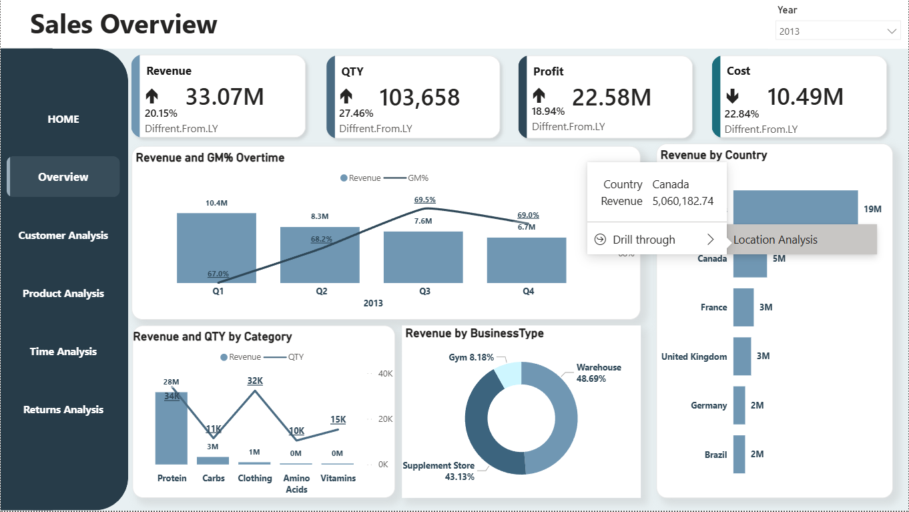
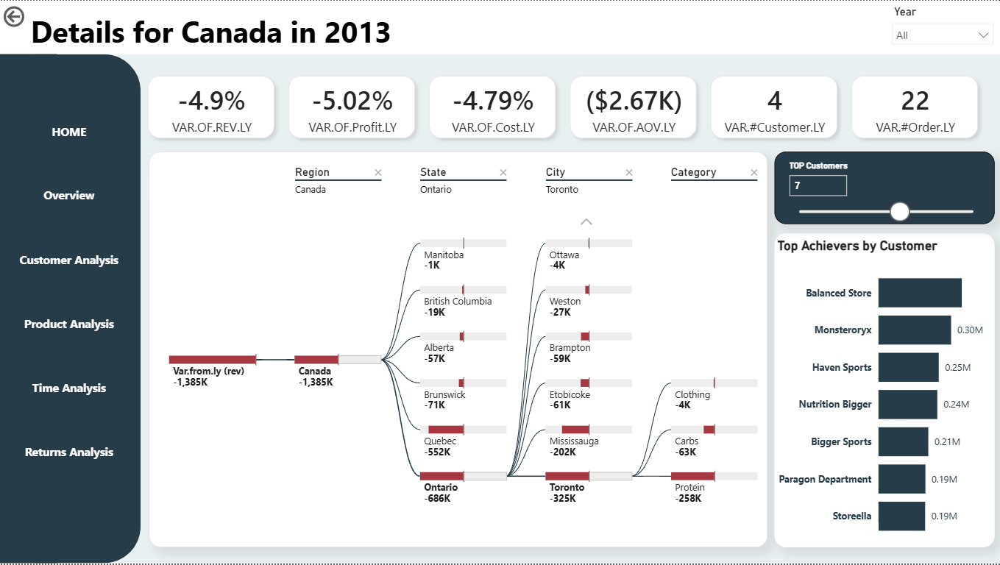

# 📊 Sales Overview & Localized Deep-Dive

This analysis establishes the macro corporate baseline across global markets, tracking structural operational growth before executing a programmatic deep-dive into regional performance variance.

---

## 💻 Executive Sales View

The primary landing view acts as the strategic monitor for corporate health, auditing revenue scales, operational spend, fulfillment volumes, and channel distribution.

### 📈 Core Business Drivers & Operational Balance

* **Top-Line Volume Scaling:** Annual performance captured **$33.07M in Total Revenue**, reflecting steady market expansion with a clear **+20.15% upward growth** track against the prior year.
  
* **Profit Realization:** Baseline efficiency preserved high margins, hitting **$22.58M in Gross Profit (+18.94% YoY)**.
  
* **Logistical Compression:** Operational efficiency improved significantly as Total Cost of Goods Sold dropped sharply to **$10.49M (a decrease of -22.84% YoY)**.
  
* **Fulfillment Velocity:** Product movement accelerated across all key sectors, securing a strong throughput of **103,658 total units sold (+27.46%)**.
  
* **Category Dependency:** The overall business engine relies heavily on a single primary anchor, with the **Protein** segment single-handedly commanding **$28M** of sales and moving **34K transactional units**.
  
* **Structural Distribution:** Inbound revenue remains evenly balanced between **Warehouse distribution channels at 48.69%** and dedicated **Supplement Stores at 43.13%**.

---

## 🔄 Programmatic Navigation: The Drill-Through Pathway

To effectively cross-examine macro metrics against localized market variations, the dashboard establishes a continuous user navigation path to translate spatial data.

### 1️⃣ Initiating the Context Pivot
Users can directly isolate regional anomalies by utilizing a native right-click drill-through on targeted high-volume nodes—such as **Canada**—within the primary country breakdown chart.

### 2️⃣ Structural Root-Cause Visualization
The drill-through target page automatically updates context filters, deploying a dynamic **Decomposition Tree** to dismantle localized losses across provincial hierarchies down to individual cities and product sub-sectors.

---

## 🔍 The Canada Case Study: Uncovering the Root Cause of Contraction

### 📉 Localized Data Breakdown
* **The Geographic Anomaly:** While global corporate metrics enjoyed double-digit upward growth, drilling into **Canada** isolates a severe regional downturn. Localized performance contracted uniformly, losing **-4.9% in Revenue** (an absolute net reduction of **-$1,385K**), dropping **-5.02% in Gross Profit**, and shrinking the **Average Order Value (AOV) by -$2.67K**.

* **Isolating the Variance via Decomposition:**
  * Structural fracturing identifies the province of **Ontario** as the central point of failure, absorbing a massive **-$686K** of the total territory losses.
    
  * Splitting Ontario down to local economic nodes demonstrates that the revenue bleeding is highly concentrated inside the city of **Toronto**, accounting for a localized loss of **-$325K**.
  
  * At the deepest operational level, the failure point within Toronto is tied directly to demand drops in two specific categories: **Protein (-$258K)** and **Carbs (-$63K)**.
    
* **Performance Outliers:** Despite the sweeping regional contraction, corporate customer accounts like **Balanced Store** and **Monsteroryx** remained highly resilient, locking in individual revenue streams of **$0.30M** respectively.

### Analytical Takeaway

The analysis highlights a strong overall business performance driven by revenue growth, higher sales volume, and improved cost efficiency. However, the data also shows a heavy dependence on the Protein category as the primary revenue driver.
