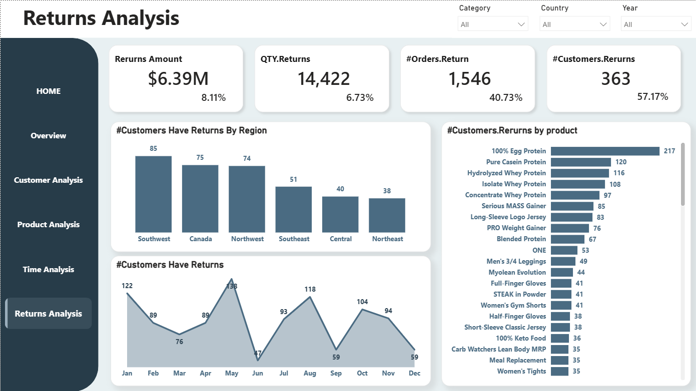

# 🔄 Returns Analytics

This analysis inspects operational friction and product rejection rates across channels, regions, and categories to isolate the primary drivers of financial revenue leaks.

---

## 💻 Returns Analytics View

### 📈 Core Business Drivers
* **Returns Amount:** Lost **$6.39M** in leaked revenue, representing an financial impact rate of **8.11%**.
  
* **QTY Returns:** Total volume reached **14,422 returned units** through the pipeline (**6.73%** of total system quantity).
  
* **#Orders.Return:** High operational friction with **1,546 total returned orders** (affecting **40.73%** of all placed orders).
  
* **#Customers.Returns:** A total of **363 individual customers** executed a return transaction (**57.17%** of the active consumer base).

---

## 🔄 Returns Leakage Breakdowns

### 1️⃣ Regional Attrition Mapping (Customer Return Counts)
* **Southwest:** The absolute highest volume point of failure with **85 customers** returning orders.
  
* **Canada:** Heavy geographic risk hub with **75 customers** executing returns.
  
* **Northwest:** Third largest friction cluster tracking at **74 customers**.

### 2️⃣ Seasonal Return Trends (Monthly Order Spikes)
* **May Peak:** Hits the absolute highest disruption window of the year with **138 returns**.
  
* **January & August Surges:** Secondary risk nodes tracking closely at **122** and **118 returns** respectively.
  
* **June Low:** Drops to an optimized calendar record low of **47 returns**.

### 3️⃣ High-Risk Products (Customer Attrition Volumes)
* **100% Egg Protein:** The primary catalog leak, single-handedly driving returns from **217 unique customers**.
  
* **Pure Casein Protein:** Second major product friction node tracking at **120 returning customers**.
  
* **Hydrolyzed Whey Protein:** High-volume product generating returns across **116 customers**.

---

## 🔍 Analytical Takeaway

**Operational disruptions are heavily concentrated within specific product formulations and regional distribution nodes:**

* **🚀 The Product Vulnerability (Egg & Casein Leakage):** *100% Egg Protein* stands as the single largest driver of operational attrition, capturing returns from **217 distinct customers**, proving that formula quality or product expectations in this category require immediate attention.
  
* **⚠️ The Territory Deficit (Southwest & Canada):** Broad geographic friction is heavily concentrated in the *Southwest* (**85**) and *Canada* (**75**), showing that the business's high-volume market channels are absorbing the heaviest fulfillment penalties.

**💡 Strategic Returns Rhythm:** Deploy an immediate product audit and customer survey targeting the *100% Egg Protein* line to fix flavor or texture dissatisfaction, and audit logistics partners in the *Southwest* and *Canada* to identify shipping errors or product damages during the seasonal **May** surge window.
