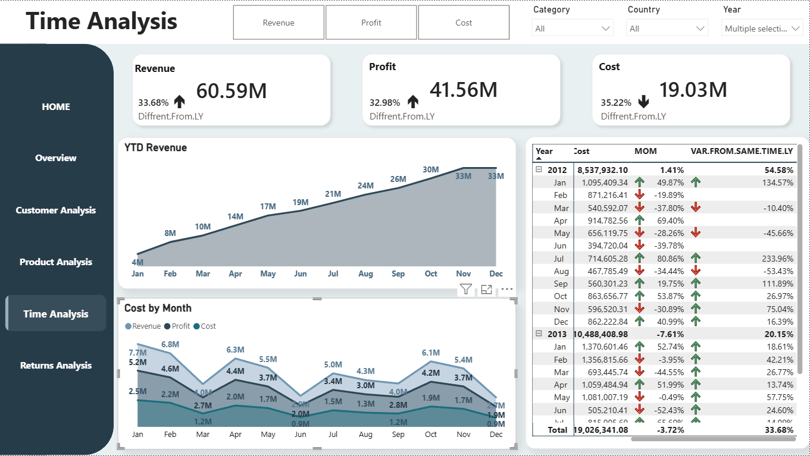
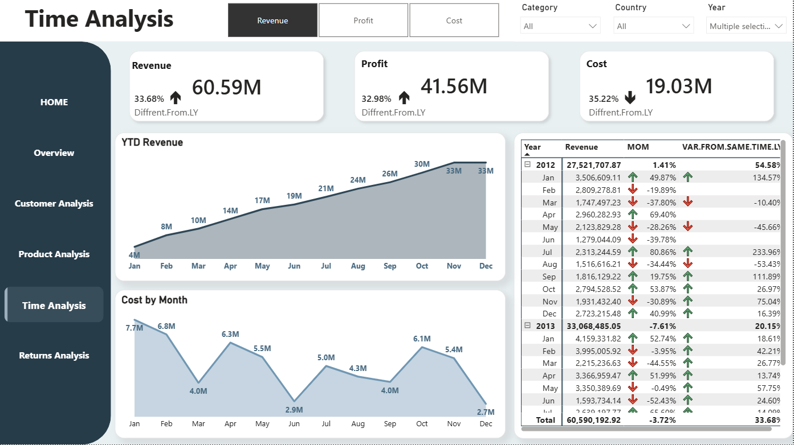
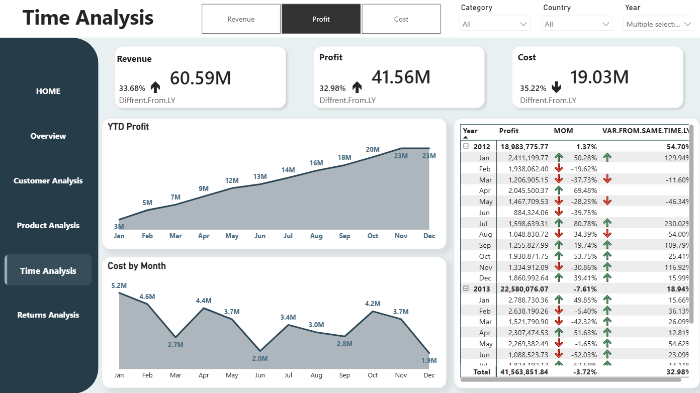
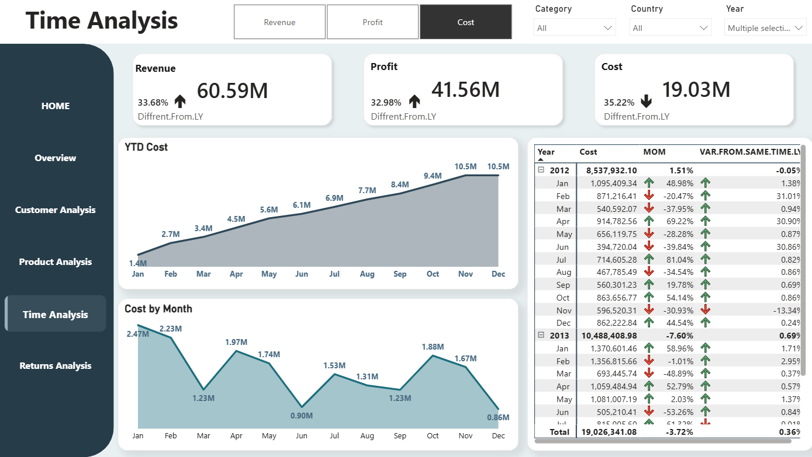

# ⏳ Time Analytics

This analysis evaluates multi-year financial performance across Revenue, Profit, and Cost to uncover seasonal business cycles.

---

## 💻 Time Analytics View

### 📈 Core Business Drivers
* **Total Revenue:** Reached **$60.59M**, driving a **+33.68% upward growth trend**.
  
* **Gross Profit:** Secured **$41.56M**, expanding the portfolio baseline by **+32.98%**.
  
* **Operational Costs:** Managed at **$19.03M**, showing a major spending reduction of **-35.22%**.
  
* **Fiscal Growth:** Performance surged between fiscal years, climbing from **$27.52M** in 2012 up to **$33.06M** in 2013.

---

## 🔄 Financial Performance Breakdowns

### 1️⃣ YTD Revenue Trends

* **Monthly Accumulation:** Revenue builds steadily from **$4M in January** to close the fiscal year at **$33M**.

### 2️⃣ Monthly Profit Realization

* **Margin Spikes:** Monthly profit hits its highest peak in January at **$5.2M**, experiences a summer drop in June to **$2.0M**, and recovers by October to **$4.2M**.

### 3️⃣ Cost Optimization Metrics

* **Expense Minimization:** Monthly expenditures peak in January at **$2.47M**, but hit a highly optimized record low in June at **$0.90M**.

---

## 🔍 Analytical Takeaway

**Maximum profitability is unlocked by matching peak seasonal revenue with tight cost control windows:**

* **🚀 The Q1 Growth Engine (January Peak):** Generates a massive **$7.7M** in active revenue while keeping costs tightly managed at **$2.47M**, securing a record **$5.2M** net profit floor.
* **🛡️ The Q2 Protection Strategy (June Low):** Successfully avoids operational losses during slower summer cycles. Revenue dips to **$2.9M**, but the bottom line remains fully protected by driving expenses down to a record-low cost floor of **$0.90M**.

**💡 Strategic Corporate Rhythm:** Scale up inventory and marketing investments aggressively during Q1 to capture high-velocity seasonal margins, then instantly pivot to a lean, cost-saving operational model during Q2 to insulate the business's profitability.
